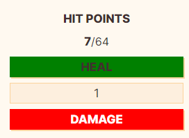
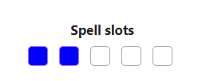

# TTRPG Stats 
TTRPGStats is a plugin for obsidian that allows you create your character sheet in obsidian with dynamic components that allow you to track your hp, spellslots, gold and way more.

# How to use
You can create the components by creating a code block with the name of the component example:

 \```ttrpgstats-hp

 \```

 The plugin uses your properties to save data. This allows you to view and edit them without the plugin. The name for the properties can be configured from the settings.

# Components
## HP - Hitpoints
Component use: ttrpgstats-hp
Examples:




## Tracker
Component use:
\```ttrpgstats-tracker
id: tracker1 
name: Spell slots
max: 5 
color: Blue
events:
  - name: short
    calc: devideMaxUp
  - event2
\```
Examples:



**TrackerConfig**:
| Name   | Type         | Required | Default | Comment                                        |
|--------|--------------|----------|---------|------------------------------------------------|
| id     | string       | Yes      |         | Value used in properties to save current value |
| name   | string       | No       |         | Value displayed on the top                     |
| max    | number       | Yes      |         | Max amount to track                            |
| color  | string       | No       | Blue    | Value displayed on the top                     |
| events | TrackerEvent | No       |         | Used to change values with button              |

**TrackerEvent**
| Name | Type                                                              | Required | Default | Comment                        |
|------|-------------------------------------------------------------------|----------|---------|--------------------------------|
| name | string                                                            | yes      |         | Name used for the event        |
| calc | zero, max, decrease, increase, devideMaxUp, devideMaxDown, double | Yes      | zero    | Action when event is triggered |

max: number // Required: Max amount to track
color: string // Optional: Color used inside the checkbox
events: // Optional: Used to change value with button
  - name: string // Required: Name used for the event
    calc: zero, max, decrease, increase, devideMaxUp, devideMaxDown, double // Optional: Default zero 