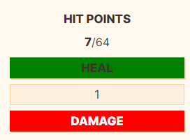
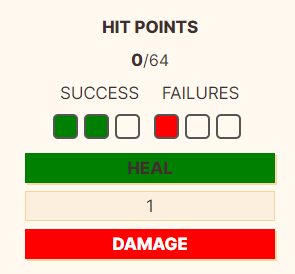
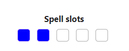
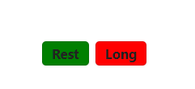

# TTRPG Stats
TTRPGStats is a plugin for Obsidian that lets you build your character sheet with dynamic components for tracking HP, spell slots, currency, skills, and more.

## Disclaimer
<span style="color:red">This plugin is currently pending submission to the Obsidian community plugins list.</span>

[Pull request](https://github.com/obsidianmd/obsidian-releases/pull/6847)

**Workaround:**
Install [BRAT](https://obsidian.md/plugins?id=obsidian42-brat) and add the following repo: `https://github.com/thopdev/TTRPGStats`

# How to use
Create a component by adding a code block with the component name:

````
```ttrpgstats-hp
```
````

The plugin saves all data to your note's frontmatter properties, so you can read and edit them without the plugin as well.

## Component Configurator
You can also insert and edit components using the built-in configurator instead of writing YAML by hand.

**To insert a new component:** Click the `+` circle icon in the ribbon, or run the command **TTRPG Stats: Insert component** from the command palette. Pick a component, fill in the form, and click Insert — the code block is added at your cursor.

**To edit an existing component:** Place your cursor inside an existing `ttrpgstats-*` code block and open the configurator. It will detect the block, pre-fill all fields with the current values, and replace the block when you click Insert.

---

# Components

## HP — Hit Points
**Code block:** `ttrpgstats-hp`

No configuration needed. The component reads and writes to property names configured in the plugin settings.

Shows current/max HP with Heal and Damage buttons. When HP reaches 0, death save checkboxes appear automatically (3 successes / 3 failures).

**Settings (configured in plugin settings, not the code block):**

| Setting                   | Default              |
|---------------------------|----------------------|
| Max health property name  | `max_health`         |
| Current health property name | `current_health`  |
| Death save success property | `death_save_success` |
| Death save failure property | `death_save_failure` |

**Examples:**




---

## Tracker
**Code block:** `ttrpgstats-tracker`

Tracks a countable resource (spell slots, ki points, etc.) as a row of checkboxes with optional event buttons.

```yaml
id: spellslots_1
name: Spell Slots (1st)
max: 4
color: Blue
events:
  - name: short
    calc: devideMaxUp
  - name: long
    calc: max
```

### TrackerConfig

| Name   | Type             | Required | Default | Description                                    |
|--------|------------------|----------|---------|------------------------------------------------|
| id     | string           | Yes      |         | Property name used to save the current value   |
| name   | string           | No       |         | Label shown above the tracker                  |
| max    | number           | Yes      |         | Maximum value                                  |
| color  | string           | No       | Blue    | Checkbox fill color                            |
| events | TrackerEvent[]   | No       |         | Buttons that trigger value changes             |

### TrackerEvent

| Name | Type                                                                        | Required | Default | Description                    |
|------|-----------------------------------------------------------------------------|----------|---------|--------------------------------|
| name | string                                                                      | Yes      |         | Button label                   |
| calc | `zero` `max` `decrease` `increase` `devideMaxUp` `devideMaxDown` `double`  | No       | zero    | Action triggered by the button |

**Examples:**



---

## Tracker Buttons
**Code block:** `ttrpgstats-button`

A row of buttons that fire events on all trackers on the page. Use this alongside multiple trackers to trigger rest actions etc. in one click.

```yaml
buttons:
  - name: Short Rest
    id: short
    color: green
  - name: Long Rest
    id: long
    color: red
```

### TrackerButtonListConfig

| Name    | Type                    | Required | Default | Description                      |
|---------|-------------------------|----------|---------|----------------------------------|
| buttons | TrackerButtonConfig[]   | Yes      |         | List of buttons to render        |
| name    | string                  | No       |         | Label shown above the buttons    |

### TrackerButtonConfig

| Name  | Type   | Required | Default | Description                                            |
|-------|--------|----------|---------|--------------------------------------------------------|
| name  | string | Yes      |         | Button label                                           |
| id    | string | Yes      |         | Event id to fire — matches `name` in TrackerEvent      |
| color | string | No       | White   | Button color                                           |

**Examples:**



---

## Valuta — Currency Tracker
**Code block:** `ttrpgstats-valuta`

Tracks multiple currency denominations with Add and Remove buttons. Supports automatic conversion between denominations.

```yaml
id: coins
allowNegative: false
convert: false
displayNull: true
valutas:
  - platinum: 1000
  - gold: 100
  - electrum: 50
  - silver: 10
  - copper: 1
```

### ValutaConfig

| Name          | Type          | Required | Default | Description                                                                 |
|---------------|---------------|----------|---------|-----------------------------------------------------------------------------|
| id            | string        | No       | coins   | Property name used when `convert: true` to store the total value            |
| allowNegative | boolean       | No       | false   | Allow values to go below zero                                               |
| convert       | boolean       | No       | false   | Store a single total value and always display in optimal denominations      |
| displayNull   | boolean       | No       | true    | Show denominations that are currently 0                                     |
| valutas       | Valuta[]      | Yes      |         | List of denominations. Each entry is `name: multiplier`                     |

Each entry in `valutas` is a key/value pair where the key is the currency name and the value is its worth in base units. Example: `gold: 100` means 1 gold = 100 copper.

**Modes:**

- **`convert: false`** (default) — each denomination is stored as its own property. When removing, if a denomination doesn't have enough, it automatically borrows from higher denominations (e.g. removing 1 silver from 10 gold → 9 gold 9 silver). A **Simplify** button collapses values into the fewest coins possible.
- **`convert: true`** — all value is stored as a single total in base units and always displayed in the optimal breakdown.

---

## Skills
**Code block:** `ttrpgstats-skills`

Displays a skill list with ability modifiers, proficiency bonuses, and totals. Reads ability scores and proficiency bonus from your note's properties.

```yaml
proficiency: proficiency_bonus
modifiers: false
sort: ability
abilities:
  str: str
  dex: dex
  con: con
  int: int
  wis: wis
  cha: cha
skills:
  - name: Athletics
    ability: str
  - name: Stealth
    ability: dex
    proficient: true
  - name: Perception
    ability: wis
    proficient: true
  - name: Persuasion
    ability: cha
    expertise: true
    comment: Bardic inspiration
```

### SkillConfig

| Name         | Type            | Required | Default             | Description                                                                                |
|--------------|-----------------|----------|---------------------|--------------------------------------------------------------------------------------------|
| proficiency  | string          | No       | `proficiency_bonus` | Property name to read proficiency bonus from                                               |
| abilities    | Record<string, string> | No | str/dex/con/int/wis/cha → same names | Maps ability abbreviation to property name. Override to point to different properties |
| modifiers    | boolean         | No       | false               | When `true`, treats ability scores as already-computed modifiers instead of raw scores     |
| sort         | `name` `ability` | No      |                     | Default display order. `name` = alphabetical, `ability` = grouped by ability              |
| skills       | SkillItem[]     | Yes      |                     | List of skills to display                                                                  |

### SkillItem

| Name       | Type    | Required | Default | Description                                                   |
|------------|---------|----------|---------|---------------------------------------------------------------|
| name       | string  | Yes      |         | Skill name                                                    |
| ability    | string  | Yes      | `str`   | Ability abbreviation this skill uses                          |
| proficient | boolean | No       | false   | Adds proficiency bonus to the total                           |
| expertise  | boolean | No       | false   | Adds double proficiency bonus to the total                    |
| comment    | string  | No       |         | Small italic note shown below the skill name                  |

The component displays columns: proficiency icon (○ / ● / ★), skill name, ability modifier, proficiency bonus, and total. A sort button in the header cycles between Default / A–Z / Ability grouping.
