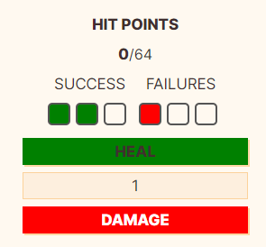

# TTRPG Stats 
TTRPGStats is a plugin for obsidian that allows you create your character sheet in obsidian with dynamic components that allow you to track your hp, spellslots, gold and way more.

## Disclaimer
<span style="color:red">Currently obsidian is still in the progress to submit this plugin. </span>

[Pull request](https://github.com/obsidianmd/obsidian-releases/pull/6847)

**Workaround:**
You can install the plugin [BRAT](https://obsidian.md/plugins?id=obsidian42-brat)
and then add the folowing repo: https://github.com/thopdev/TTRPGStats
# How to use
You can create the components by creating a code block with the name of the component example:

 \```ttrpgstats-hp

 \```


 The plugin uses your properties to save data. This allows you to view and edit them without the plugin. The name for the properties can be configured from the settings.

# Components
## HP - Hitpoints
Component use: ttrpgstats-hp
Examples:





## Tracker
Component use:
ttrpgstats-tracker
```yaml
id: tracker1 
name: Spell slots
max: 5 
color: Blue
events:
  - name: short
    calc: devideMaxUp
  - event2
```
Examples:


## Config
### TrackerConfig
| Name   | Type           | Required | Default | Comment                                        |
|--------|----------------|----------|---------|------------------------------------------------|
| id     | string         | Yes      |         | Value used in properties to save current value |
| name   | string         | No       |         | Value displayed on the top                     |
| max    | number         | Yes      |         | Max amount to track                            |
| color  | string         | No       | Blue    | Value displayed on the top                     |
| events | TrackerEvent[] | No       |         | Used to change values with button              |

### TrackerEvent
| Name | Type                                                              | Required | Default | Comment                        |
|------|-------------------------------------------------------------------|----------|---------|--------------------------------|
| name | string                                                            | yes      |         | Name used for the event        |
| calc | zero, max, decrease, increase, devideMaxUp, devideMaxDown, double | Yes      | zero    | Action when event is triggered |

max: number // Required: Max amount to track
color: string // Optional: Color used inside the checkbox
events: // Optional: Used to change value with button
  - name: string // Required: Name used for the event
    calc: zero, max, decrease, increase, devideMaxUp, devideMaxDown, double // Optional: Default zero 

## Tracker Button
Component use:
ttrpgstats-button
```yaml
buttons:
 - name: Rest
   id: short
   color: green
 - name: Long
   id: long
   color: red
```

Examples: 


## Config
### TrackerButtonListConfig
| Name    | Type                  | Required | Default | Comment                           |
|---------|-----------------------|----------|---------|-----------------------------------|
| buttons | TrackerButtonConfig[] | Yes      |         | Array containing the buttons      |
| name    | string                | No       |         | Value displayed on the top        |
| max     | number                | Yes      |         | Max amount to track               |
| color   | string                | No       | Blue    | Color used for checkbox           |
| events  | TrackerEvent          | No       |         | Used to change values with button |

### TrackerButtonConfig
| Name | Type   | Required | Default | Comment                                         |
|------|--------|----------|---------|-------------------------------------------------|
| name | string | Yes      |         | Name inside the button                          |
| id   | number | Yes      |         | Id of event that is trigged, as used in tracker |
| color | string | No       | White   | Color of the button                   


# Valuta (Currency Tracker)
Component use:
`ttrpgstats-valuta`
```yaml
id: convertnegative
allowNegative: true
convert: true
valutas:
  - platium: 1000
  - gold: 100
  - electrum: 50
  - silver: 10
  - copper: 1
```

### ValutaConfig
| Name          | Type    | Required | Default | Comment                                              |
|---------------|---------|----------|---------|------------------------------------------------------|
| id            | string  | Yes      |         | Unique identifier for this valuta block              |
| allowNegative | boolean | No       | false   | Allow negative values for currencies                 |
| convert       | boolean | No       | false   | Automatically convert between currencies if possible |
| valutas       | array   | Yes      |         | List of currency types and multipliers               |

**Example:**
This will create a currency tracker that allows negative values and will automatically convert between currencies (e.g., 10 silver → 1 gold) as needed.


